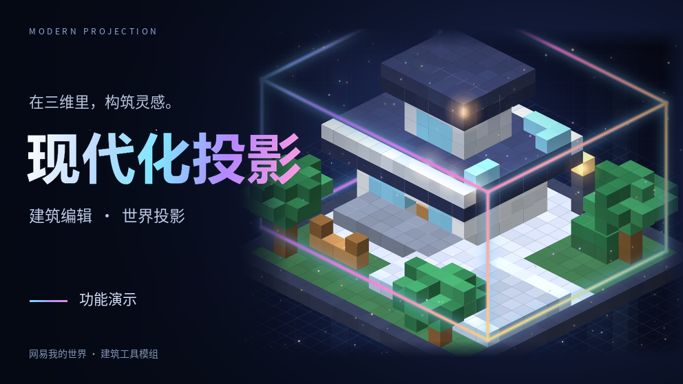
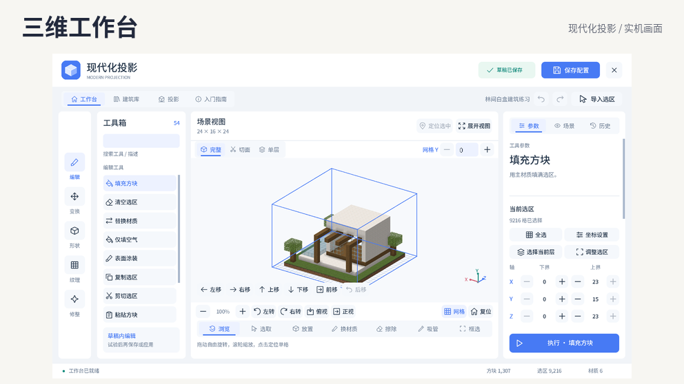
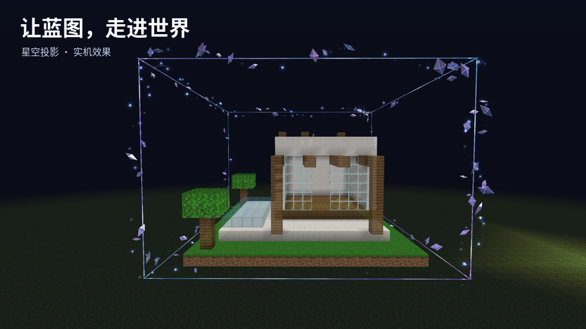

# 现代化投影 · Modern Projection

面向网易《我的世界》基岩版 ModSDK 的建筑编辑与投影模组。用三维工作台编辑建筑，通过法杖测绘世界中的区域，再将蓝图投影到目标位置，辅助逐层建造。



**作者：** [Happy2018new](https://github.com/Happy2018new)

**许可：** 本项目原创代码与资产保留所有权利，仅授权个人、非商业的学习与研究使用。公开源码不代表允许自由复用、再分发或商业使用。完整条款见 [LICENSE](LICENSE)，第三方内容另见 [THIRD_PARTY_NOTICES.md](THIRD_PARTY_NOTICES.md)。

本项目使用 PyreactMC 客户端 UI 框架

## 功能

- **三维建筑工作台**：旋转、缩放、平移与深入观察建筑，支持完整、切面、单层视图，以及直接放置、擦除、换材质、吸管和框选。
- **批量编辑**：填充、替换、复制粘贴、形状与纹理工具，配合图层锁定、方块条件和草稿撤销／重做。
- **建筑库与分享**：在本机保存多个建筑配置，通过分享码导入、导出，支持分段复制。
- **世界测绘与投影**：选取世界中两个角点并导入建筑，设置投影原点、可见图层和透明度，对照蓝图建造。
- **生物群系预览**：调整草地、树叶等方块的着色，在编辑预览和世界投影中展示对应效果。
- **双法杖与星空特效**：星穹法杖打开工作台，星霜法杖测绘选区；配有星空材质、环绕晶体及炫彩范围框。
- **键鼠与触屏操作**：提供鼠标拖动、滚轮缩放，以及触屏点选、双指缩放与安全区适配。





## 开始使用

本项目依赖网易版 ModSDK；运行环境是网易开发客户端／兼容的网易版游戏环境，不能直接作为 Java 版模组或国际基岩版通用附加包使用。

以下本地运行步骤用于许可证允许的学习与研究。正式发布、运营、向他人提供模组或复用代码与资产，需要另行取得相应授权。

1. 在网易 MC Studio 的本地开发项目中同时加载本仓库的 `behavior_pack/` 和 `resource_pack/`，保持目录结构完整。
2. 进入测试世界，通过原版工作台合成下面的两种法杖；有指令权限的测试世界也可以使用下方指令获取。
3. 手持**星穹法杖**，电脑端右键使用，触屏端点击手持时出现的工作台按钮，即可打开三维工作台。
4. 编辑初始建筑，或在建筑库中新建草稿。要导入已有建筑，手持**星霜法杖**选取两个角点，再导入选区。
5. 保存建筑配置，在投影页设置目标原点并生成投影，关闭工作台后即可在世界中对照建造。

```text
/give @s modern_projection:terminal 1
/give @s modern_projection:survey_wand 1
```

完整操作说明见 [使用说明](docs/MODERN_PROJECTION.md)。历史开发记录描述的是对应阶段的实现，具体功能以当前代码和游戏界面为准。

### 星穹法杖 · 投影终端

标识符：`modern_projection:terminal`。在原版工作台按下表摆放，得到 1 支法杖。

| 第一列 | 第二列 | 第三列 |
| --- | --- | --- |
| 铁锭 | 玻璃 | 铁锭 |
| 红石粉 | 指南针 | 红石粉 |
| 空 | 铁锭 | 空 |

共需铁锭 ×3、玻璃 ×1、红石粉 ×2、指南针 ×1。

### 星霜法杖 · 投影测绘器

标识符：`modern_projection:survey_wand`。在原版工作台按下表摆放，得到 1 支法杖。

| 第一列 | 第二列 | 第三列 |
| --- | --- | --- |
| 空 | 空 | 青金石 |
| 空 | 红石粉 | 空 |
| 木棍 | 空 | 空 |

共需青金石 ×1、红石粉 ×1、木棍 ×1。电脑端右键选取两个方块后左键导入；触屏端轻触两个方块后点击“导入选区”。

## 当前范围与限制

- 单份建筑尺寸上限为 **64 × 128 × 64** 格，本机建筑库最多保存 **32** 份配置。
- 建筑配置保存方块数据，不包含箱子物品、告示牌文字、生物等实体或完整方块实体数据。
- 建筑投影和测绘范围框在本机客户端显示；建筑库也保存在本机，通过分享码传递配置。
- 三维外观受 SDK 原生方块几何体支持范围限制；部分特殊方块外观、透明排序和方向性方块变换存在限制。
- 生存建造以投影辅助为主。实际世界写入需要创造模式及相应权限；**写入完成后无法撤销**，与工作台内草稿的撤销／重做不同。
- 手机操作与渲染效果会受到游戏版本、设备和图形能力影响，PC 触屏模拟不能代替各机型的实际验证。

## 目录

| 路径 | 内容 |
| --- | --- |
| [`behavior_pack/modern_projection/`](behavior_pack/modern_projection/) | 客户端、服务端入口及模组 Python 代码 |
| [`behavior_pack/modern_projection/projection/`](behavior_pack/modern_projection/projection/) | 编辑内核、三维视口、工作台、存储、分享与世界操作 |
| [`behavior_pack/modern_projection/pyreact/`](behavior_pack/modern_projection/pyreact/) | 带本地补丁的 PyreactMC，保留上游许可 |
| [`resource_pack/`](resource_pack/) | JsonUI、模型、纹理、着色器、材质与语言资源 |
| [`tests/`](tests/) | 离线回归测试 |
| [`tools/`](tools/) | 资源生成、静态检查、性能分析与实机回归工具 |
| [`docs/`](docs/) | 使用说明、设计与验证记录、特效预览 |
| [`extras/astral_survey_v1/`](extras/astral_survey_v1/) | 历史星穹测绘特效快照，同样受项目许可约束 |
| [`dist/`](dist/) | 导出归档，同样受对应代码与资产的许可约束 |
| [`release/`](release/) | 宣传图片与视频素材 |

`.runtime/`、`.tools/` 为本地诊断产物和工具缓存，不纳入版本管理。框架示例 `examples/` 已移除，模组运行不依赖该目录。

## 本地开发与验证

游戏内代码兼容网易 ModSDK 的 **Python 2.7**；宿主机工具使用 Python 3，MCDK 受管调试工具要求 **Windows x64、PowerShell 与 Python 3.12+**。游戏内模块依赖 ModSDK，不能直接用宿主 Python 启动整个模组。

在仓库根目录执行离线测试与导入白名单检查：

```powershell
python -m pip install Pillow
python -m unittest discover -s tests -v
python -X utf8 tools/audit_runtime_imports.py
```

这里的 `python` 指宿主机 Python 3 解释器。资源再生成还需要相应字体文件及 `fonttools` 等依赖，操作见 [字体资源说明](docs/FONT_ATLASES.md)。

实机调试通过 [MCDevTool](https://github.com/GitHub-Zero123/MCDevTool) 启动独立开发世界，前置检查和启动步骤见 [调试环境搭建](.agents/skills/pyreact-debugging/references/setup.md) 与 [独立实例说明](.agents/skills/pyreact-debugging/references/instances.md)。更详细的实现与回归记录见 [开发记录](docs/DEVELOPMENT.md)。

## 著作权与第三方许可

**Copyright (c) 2026 Happy2018new. All rights reserved. 保留所有权利。**

本仓库原创代码、着色器、模型、纹理、界面、文档与宣传资产等，仅允许按 [LICENSE](LICENSE) 在个人、非商业的学习研究范围内阅读、下载、私下运行与实验。未经书面授权，不得将这些内容用于其他项目的发布、商业使用、服务器运营、素材分发或衍生版本发布。标注来源或免费提供不等于取得授权。本项目不按开放源代码许可证发布。

第三方内容的权利和原有许可独立保留，本项目的学习用途限制不覆盖或缩减第三方已授予的权利：

| 内容 | 许可与说明 |
| --- | --- |
| [PyreactMC](https://github.com/EnderWolf006/PyreactMC) 及本项目中的修改版本 | 上游自定义许可 v1.1，见随附 [LICENSE](behavior_pack/modern_projection/pyreact/LICENSE) 与 [NOTICE](behavior_pack/modern_projection/pyreact/NOTICE)；不是 Apache-2.0 或 MIT |
| three.js | [MIT License](docs/vendor/three.LICENSE.txt) |
| Noto Sans SC 字体相关内容 | 保留 [SIL Open Font License 1.1](resource_pack/textures/modern_projection/OFL.txt) 及原作者声明 |
| Minecraft、网易 ModSDK 及其他第三方游戏素材与标识 | 归相应权利人所有，不由本仓库授予相关权利 |

**PyreactMC 上游条件：** 在网易版作品详情介绍中须按 NOTICE 保留“本项目使用 PyreactMC 客户端 UI 框架”原文；相关开发者账户下全部付费组件与全部网络游戏的累计获取量合计达到或超过 **1,000,000 次**时，须事先取得上游原作者另行书面授权。该门槛不是本模组单独的下载量或收入门槛。仅在 README 中署名不能替代作品详情介绍中的声明；完整适用条件以上游文件为准。

第三方来源、范围和版本见 [第三方声明](THIRD_PARTY_NOTICES.md)，Pyreact 本地修改见 [上游同步记录](docs/PYREACT_UPSTREAM.md)。超出学习范围的使用，请通过 [项目 Issues](https://github.com/Happy2018new/better-building-editor/issues) 联系作者，取得明确书面授权后再实施。
